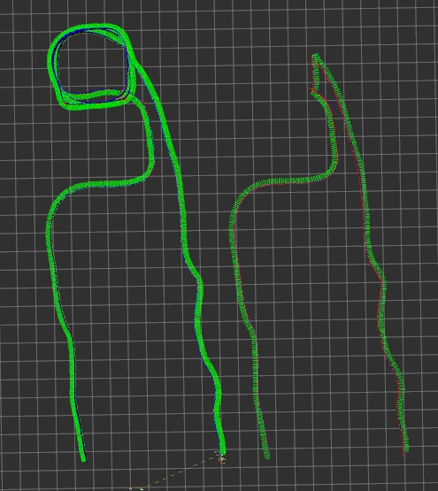

# Title

this is a ros1 package for search a reverse path based on given robot travel path ,it will generate an undirected graph based on this path and set the bounding box parameters for each path point using the thresholdDist parameter. Each point will establish edges with other points enclosed within the bounding box\



## dependense

Eigen3 \
Boost

## Install

```shell
cd catkin_ws/src
git clone https://github.com/xiaozhangniaibu/Reverse_path_search.git
catkin_make
```

## Usage

```shell
roslaunch reverse_path_search example.launch
```
